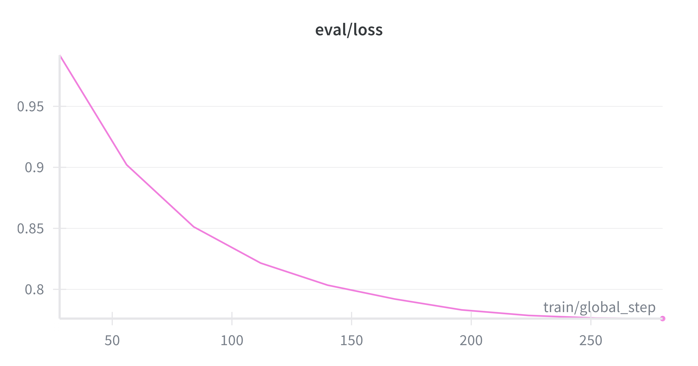
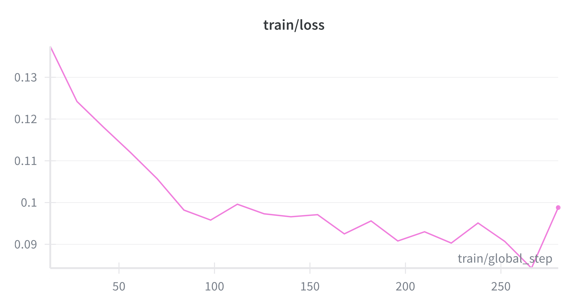

# VLMs finetuned on Bulgarian language

Initial results on translated versions of MMMU_val, MMStar and MME:

| Benchmark       | Metric                  | Base (Qwen2-VL 2B Instruct) | Finetuned | Δ (Finetuned − Base) |      Δ % |
| --------------- | ----------------------- | --------------------------: | --------: | -------------------: | -------: |
| **MMMU_val_bg** | score                   |                        0.29 |    0.2911 |              +0.0011 |   +0.38% |
| **MMStar_bg**   | average                 |                      0.0215 |    0.0074 |              -0.0141 |  -65.58% |
| **MMStar_bg**   | coarse perception       |                      0.0924 |    0.0000 |              -0.0924 | -100.00% |
| **MMStar_bg**   | fine-grained perception |                      0.0112 |    0.0140 |              +0.0028 |  +25.00% |
| **MMStar_bg**   | instance reasoning      |                      0.0150 |    0.0067 |              -0.0083 |  -55.33% |
| **MMStar_bg**   | logical reasoning       |                      0.0066 |    0.0030 |              -0.0036 |  -54.55% |
| **MMStar_bg**   | math                    |                      0.0039 |    0.0000 |              -0.0039 | -100.00% |
| **MMStar_bg**   | science & technology    |                      0.0000 |    0.0206 |              +0.0206 |        — |
| **MME_bg**      | mme_cognition_score     |                    411.4286 |  421.0714 |              +9.6428 |   +2.34% |
| **MME_bg**      | mme_perception_score    |                   1310.1282 | 1307.4054 |              -2.7228 |   -0.21% |

The finetuned model is available on https://huggingface.co/petkopetkov/Qwen3-VL-2B-Instruct-bg

It can be reproduced by running the following training script:

```
python vlm_training/train_vlm.py
```

Training and eval plots:





NOTE: This training and evaluation are very limited (small dataset size and little hyperparameter tuning). Future work includes training on the whole translated FineVision dataset (https://huggingface.co/datasets/petkopetkov/FineVision-bg) and performing tthorough evaluation on translated versions of the standard VLM benchmarks.

# LLMs finetuned on Bulgarian language

This project contains various experiments on finetuning small LLMs (SmolLM, Llama, Gemma) on Bulgarian language. Multiple datasets translated to Bulgarian are included (MMLU, Hellaswag, MathQA, Winogrande, GSM8K, ARC Easy/Challenge, OASST1, OASST2):

- MMLU - https://huggingface.co/datasets/petkopetkov/mmlu-bg
- Hellaswag - https://huggingface.co/datasets/petkopetkov/hellaswag-bg
- MathQA - https://huggingface.co/datasets/petkopetkov/math_qa-bg
- Winogrande - https://huggingface.co/datasets/petkopetkov/winogrande_xl-bg
- GSM8K - https://huggingface.co/datasets/petkopetkov/gsm8k-bg
- ARC Easy - https://huggingface.co/datasets/petkopetkov/arc-easy-bg
- ARC Challenge - https://huggingface.co/datasets/petkopetkov/arc-challenge-bg
- OASST1 - https://huggingface.co/datasets/petkopetkov/oasst1_bg
- OASST2 - https://huggingface.co/datasets/petkopetkov/oasst2_bg
  
More information on the datasets can be found [here](./datasets/README.md).

### Create virtual environment:

```
python -m venv env && source ./env/bin/activate
```

### Install required packages:

```
pip install -r requirements.txt
```

## Finetune on MMLU, Hellaswag, MathQA, Winogrande, GSM8K, ARC Easy/Challenge

The MMLU, Hellaswag, MathQA, Winogrande, GSM8k, ARC Easy/Challenge datasets are translated to Bulgarian (the scripts for the translations are in the datasets/translations folder).

### How to finetune:

Prepare the datasets for training:

```
python ./datasets/preparation/process_datasets.py
```

Start the training process:

```
python ./llm_training/llm_trainer.py
```

### Custom tokenizer

Since the Llama tokenizer doesn't handle cyrillic tokens very well, a new tokenizer can be trained. It can handle Bulgarian text better but its performance on English text will probably be worse unless english is included in the training data too. The data for the training is the https://huggingface.co/datasets/petkopetkov/chitanka dataset which includes only Bulgarian text.

Prepare the tokenizer training data:

```
python ./llm_training/tokenizer/prepare_tokenizer_data.py --split=validation --lang=bg --docs_to_sample=300000 --save_path=./data
```

Train a new tokenizer:

```
python ./llm_training/tokenizer/train_tokenizer.py
```

### Finetuned models

Finetuned models on the translated MMLU, Hellaswag, MathQA, Winogrande, GSM8k, ARC Easy/Challenge datasets:

- SmolLM2-360M - https://huggingface.co/petkopetkov/SmolLM2-360M-bg
- SmolLM2-135M - https://huggingface.co/petkopetkov/SmolLM2-135M-bg
- Llama3.2-1B - https://huggingface.co/petkopetkov/Llama3.2-1B-bg
- Llama3.2-1B-Instruct - https://huggingface.co/petkopetkov/Llama3.2-1B-Instruct-bg
- Llama3.2-1B (custom tokenizer) - https://huggingface.co/petkopetkov/Llama3.2-1B-bg-tokenizer
- Gemma-2-2B - https://huggingface.co/petkopetkov/gemma-2-2b-bg

Results from the training (train and eval loss plots) can be found [here](../results/README.md).

### Evaluation

To evaluate a model (in this case SmolLM2-360M-bg) on all of the available tasks:

```
lm_eval \
  --model hf \
  --model_args pretrained=petkopetkov/SmolLM2-360M-bg \
  --tasks \
    mmlu_bg,hellaswag_bg,mathqa_bg,winogrande_bg,gsm8k_bg,arc_easy_bg,arc_challenge_bg \
  --device cuda:0 \
  --batch_size auto:4 \
  --include_path ./evaluation/tasks \
  --output_path ./results
```

More information [here](./evaluation/README.md).

## Finetune on OASST1 Bulgarian dataset

OpenAssistant Conversations Dataset (OASST1 and OASST2) translated to Bulgarian language can be used for the finetuning. The datasets are available on https://huggingface.co/datasets/petkopetkov/oasst1_bg and https://huggingface.co/datasets/petkopetkov/oasst2_bg.

### How to finetune:

```
python ./llm_training/oasst_1/finetune.py tuned_model dataset_name instruction_prompt
```

### Example parameters:

```
python ./llm_training/oasst_1/finetune.py petkopetkov/Llama3.2-1B-Instruct-bg petkopetkov/oasst1_bg "Ти си полезен асистент, който отговаря само на български език."
```

### Finetuned models on OASST1 Bulgarian dataset

Finetuned models on the translated OASST1 Bulgarian dataset:

- SmolLM2-1-7B - https://huggingface.co/petkopetkov/SmolLM2-1.7B-bg
- SmolLM2-1-7B-Instruct - https://huggingface.co/petkopetkov/SmolLM2-1.7B-Instruct-bg
- SmolLM-1-7B - https://huggingface.co/petkopetkov/SmolLM-1-7B-bg
- Llama3.2-3B-Instruct - https://huggingface.co/petkopetkov/Llama3.2-3B-Instruct-bg

## Finetune on synthetic dataset from books translated to Bulgarian

The project also contains an experiment with generating synthetic question-answer dataset based on books translated to Bulgarian language using other language models such as [BgGPT](https://huggingface.co/INSAIT-Institute/BgGPT-Gemma-2-9B-IT-v1.0) and finetuning models on this dataset. The dataset is available on https://huggingface.co/datasets/petkopetkov/QABGB.

### Generate synthetic question-answer dataset on Bulgarian books:

```
python ./datasets/preparation/generate_dataset_pairs.py
```

### How to finetune on the synthetic dataset:

The experiment is implemented in the following notebook:

[llama_QABGB_dataset_finetune.ipynb](./llm_training/QABGB/llama_QABGB_dataset_finetune.ipynb)
