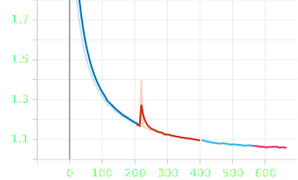
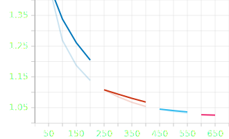
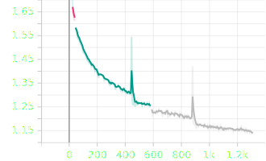
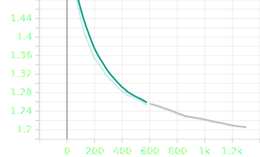
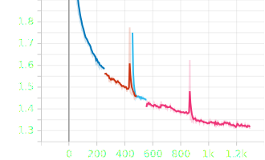
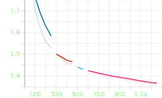
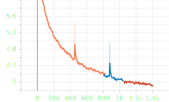
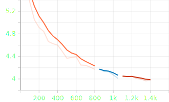
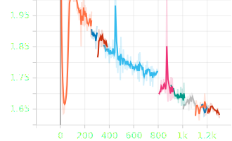
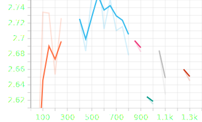

### SmolLM2-135M (batch size 128, 3 epochs)

All Tensorboard metrics: https://huggingface.co/petkopetkov/SmolLM2-135M-bg/tensorboard

| Train Loss | Eval Loss |
|------------|-----------|
|  |  |

### Llama3.2-1B (batch size 64, 3 epochs)

All Tensorboard metrics: https://huggingface.co/petkopetkov/Llama3.2-1B-bg/tensorboard

| Train Loss | Eval Loss |
|------------|-----------|
|  |  |
| <b>Train loss</b> | <b>Eval loss</b> |

### Llama3.2-1B-Instruct (batch size 64, 3 epochs)

All Tensorboard metrics: https://huggingface.co/petkopetkov/Llama3.2-1B-Instruct-bg/tensorboard

| Train Loss | Eval Loss |
|------------|-----------|
|  |  |
| <b>Train loss</b> | <b>Eval loss</b> |

### Llama3.2-1B (custom tokenizer, batch size 64, 3 epochs)

All Tensorboard metrics: https://huggingface.co/petkopetkov/Llama3.2-1B-Instruct-bg-tokenizer/tensorboard

| Train Loss | Eval Loss |
|------------|-----------|
|  |  |
| <b>Train loss</b> | <b>Eval loss</b> |

### Gemma-2-2B (batch size 64, 3 epochs)

All Tensorboard metrics: https://huggingface.co/petkopetkov/gemma-2-2b-bg/tensorboard

| Train Loss | Eval Loss |
|------------|-----------|
|  |  |
| <b>Train loss</b> | <b>Eval loss</b> |
